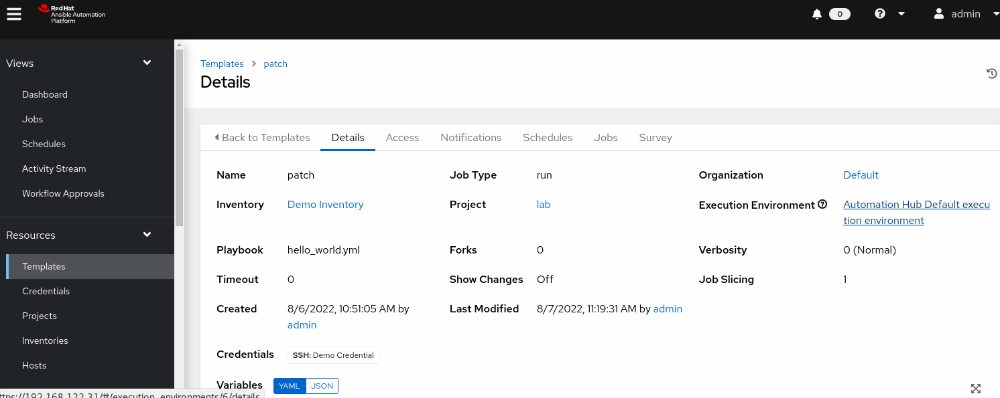
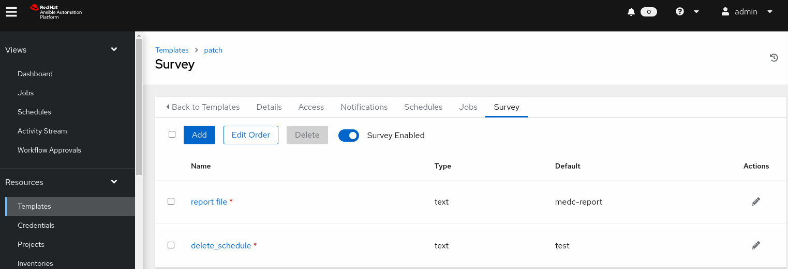
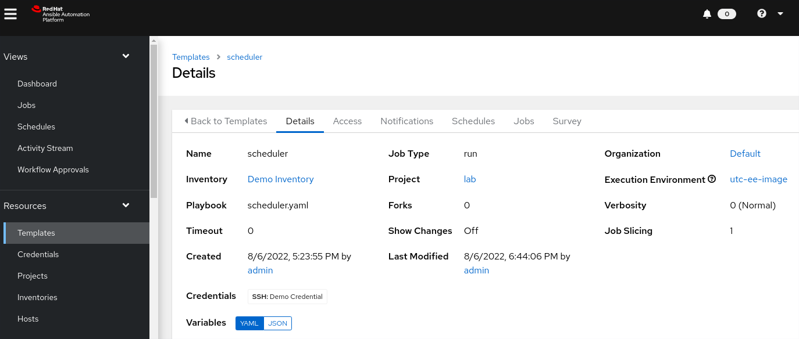
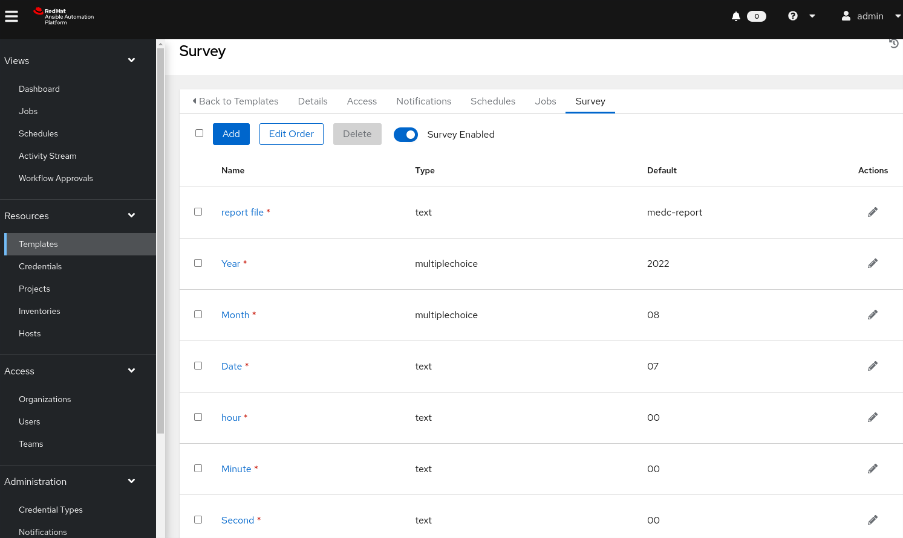
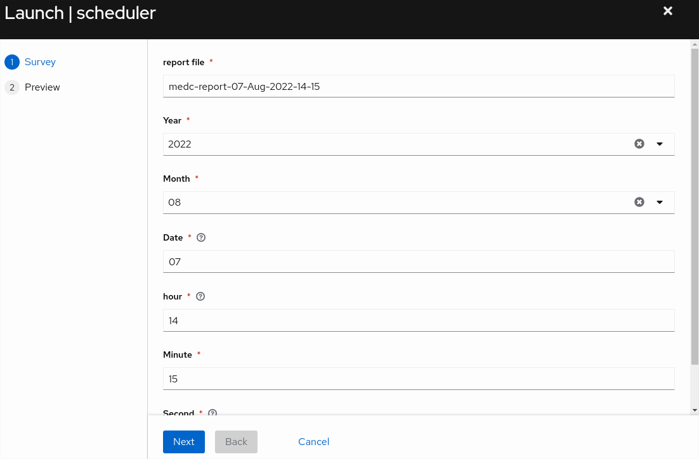
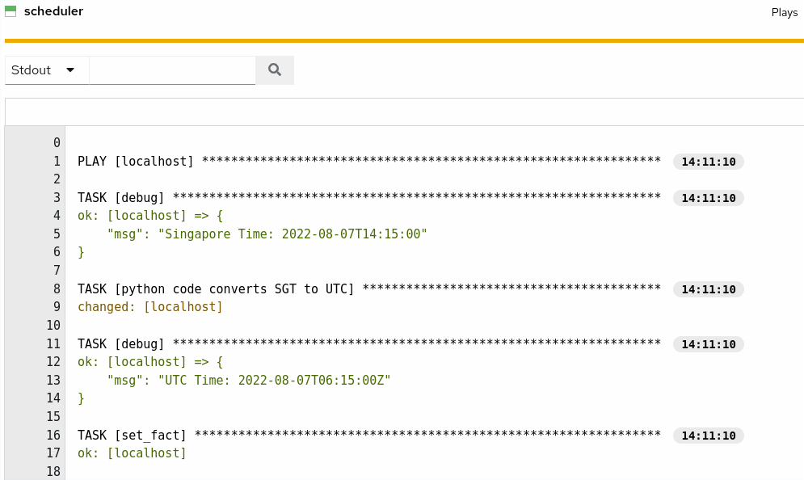
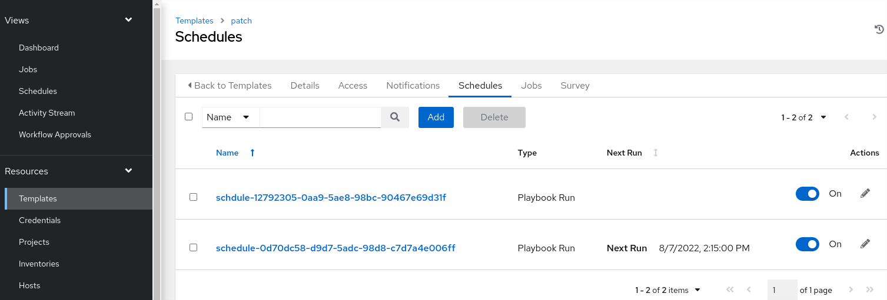
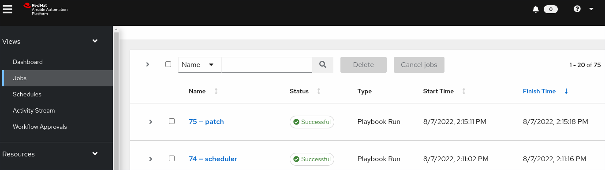
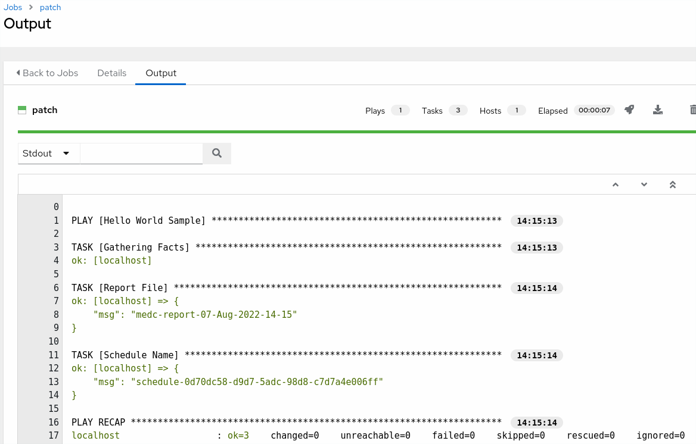

# AAP-Scheduler-API

**Git**
```
echo "# AAP-Scheduler-API" >> README.md
git init
git add README.md
git commit -m "first commit"
git branch -M main
git remote add origin https://github.com/alpha-wolf-jin/AAP-Scheduler-API.git
git config --global credential.helper 'cache --timeout 7200'
git push -u origin main

git add . ; git commit -a -m "update README" ; git push -u origin main

```

# BackGroud

The customer has a batch of VMs for patching. These VMs has different 

approved maintance windows for ptaching. And patch needs some pre & post works, LB, 

cluster, verification and so on, which are beyond the individule server patch task. 

It is orchestration work. This use case requests this orchestration work can be 

dynacmically scheduled to different time windows.


The modules `win_scheduled_task` & `cron` have schedule function.

They are suitable for individual host schedule, not for orchestration 

work schedule. And AAP is more for orchestration and configuration

management, not desgined for schedule tools.


Here we try to explore the `schedules` function in job 

template for such dynamic orchestrtion task scheduling.


## Explore Solution

- `patching` job template for patching task
- `scheduler` job template to configure `Schedules` for `patching` job template 


# Customize the execution image

**customize**
- add `tzdata` rpm to execution image
- set timezone of execution image to `Asia/Singapore`

Refer to **`Solution 01`**

https://github.com/alpha-wolf-jin/AAP-Builder-TroubleShoot


### Job Temlate `patch`




In order to receive the extra varialbes `report_file` and `delete_schedule`

from the API call from job templet `scheduler`, both vars are in survey form.




**`patch.yaml` playbook**
```
# cat patch.yaml 
- name: Patch
  hosts: all
  vars:

  tasks:
    - name: Report File
      debug:
        msg: "{{ report_file | default('Hello World!') }}"

    - name: Schedule Name
      debug:
        msg: "{{ delete_schedule | default('Hello World!') }}"
```

### Job Temlate `scheduler`

Configure the new Credentail for quay registry







**`scheduler.yaml` playbook**
```
# cat scheduler.yaml
---
- hosts: localhost
  connection: local
  become: true
  gather_facts: false

  vars:
    app_ip: 192.168.122.31
    user_id: 1
    job_template_id: 9

  tasks:
 
  - debug:
          msg: "Singapore Time: {{ year }}-{{ month }}-{{ date }}T{{ hour }}:{{ min }}:{{ sec }}"

  # it is easy to do time conversion in the python
  # Below is to directly use python code for time conversion
  # It requires tzdata packge and environment TZ is SGT
  - name: python code converts SGT to UTC
    register: results
    args:
      stdin: |
        from datetime import datetime
        import pytz

        dt_str  = "{{ year }}{{ month }}{{ date }}T{{ hour }}{{ min }}{{ sec }}"
        format = "%Y%m%dT%H%M%S"
        local_dt = datetime.strptime(dt_str, format)

        dt_utc = local_dt.astimezone(pytz.UTC)
        format = "%Y-%m-%dT%H:%M:%SZ"
        dt_utc_str = dt_utc.strftime(format)

        print(dt_utc_str)     
    command: /usr/bin/python3

  - debug:
      msg: "UTC Time: {{ results.stdout }}"


  - set_fact:
      utc_date: "{{ results.stdout }}"

  - name: retrieve the Ansible Tower Token
    uri:
      url: https://{{ app_ip }}/api/v2/users/{{ user_id }}/personal_tokens/
      user: admin
      password: redhat
      method: POST
      force_basic_auth: yes
      headers:
        Content-Type: application/json
      return_content: yes
      validate_certs: no
      status_code: [200, 201]
      body_format: json
      body:
        extra_vars:
          description: "Tower CLI"
          application: null
          scope: write
    register: result

  # the schedule name has to be uniq
  - set_fact:
      token: "{{ result['json']['token'] }}"
      sgt_date: "{{ year }}{{ month }}{{ date }}T{{ hour }}{{ min }}{{ sec }}"
      schedule_name: "schedule-{{ 99999999 | random | to_uuid }}"

  # the schdule can have it's own extra_data pasing the extr varaibles' value
  # to the job tempalte patch
  # The REST API needs boht SGT and UTC times :-)
  - name: Add the schdule to the job template patch.yaml
    uri:
      url: https://{{ app_ip }}/api/v2/job_templates/{{ job_template_id }}/schedules/
      method: POST
      headers:
        Authorization: "Bearer {{ token }}" 
      return_content: yes
      validate_certs: no
      status_code: [200, 201]
      body_format: json
      body:
          rrule: "DTSTART;TZID=Asia/Singapore:{{ sgt_date }} RRULE:INTERVAL=1;COUNT=1;FREQ=MINUTELY"
          name: "{{ schedule_name }}"
          description: ""
          extra_data: 
            report_file: "{{ report_fie_location }}"
            delete_schedule: "{{ schedule_name }}"
          inventory: null
          scm_branch: ""
          job_type: null
          job_tags: ""
          skip_tags: ""
          limit: ""
          diff_mode: null
          verbosity: null
          enabled: true
          unified_job_template: 9
          dtstart: "{{ utc_date }}"
          dtend: "{{ utc_date }}"
          next_run: null
          timezone: "Asia/Singapore"
          until: ""
    register: result

```

# Verification

- can schudle the ad-hoc patch task


**Lanch and fill survey for job template `scheduler`**

Input value
```
report file: medc-report-07-Aug-2022-14-15
Year: 2022       Month: 08        Date: 7
hour: 14         Minute: 15       Second: 00
```


Out put of the job template `scheduler`


**New schdule added as required**


**The job started at scheduled time**


**The paramteres values are right in `patch`, which received from `scheduler`**


## Further

The input for job tempalte `scheduler` can be more complicated, like:
```
2022-08-09 22:15:00  server1,server2,server3
2022-08-10 22:15:00  server1,server2,server3
2022-08-11 22:15:00  server1,server2,server3
```
In this way, AAP can take certain schedule tools role.


## Challeges `how to delete used schedules?`

Failed to find command or REST API to auto delete the used schedules.
